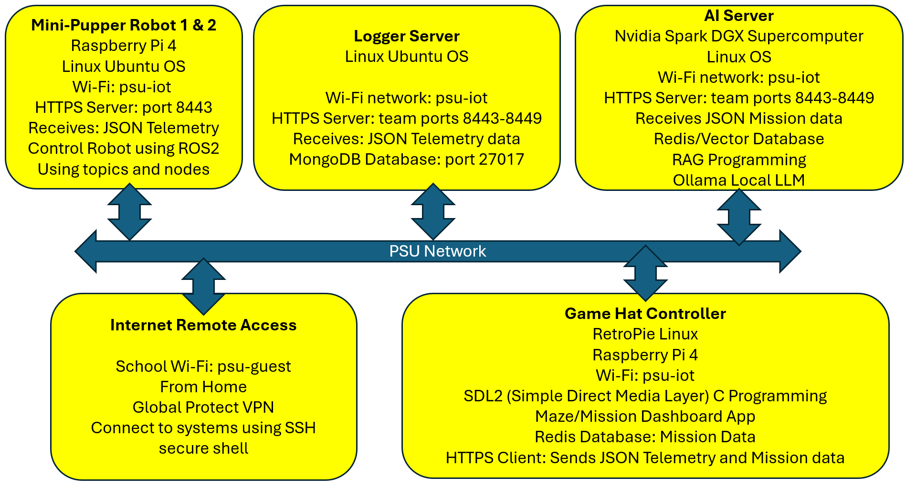

# abcapsp26TuThT1

# 🐾 Mini-Pupper Swarm Exploration with Secure AI-RAG Diagnostics

**Senior Capstone – Spring 2026 Tuesday and Thursday Team 1**  
**Penn State Abington – CMPSC & IT**

---

## 📌 Project Overview

This project implements a **secure, autonomous swarm of Mini-Pupper quadruped robots** capable of **parallel maze exploration** using **reinforcement learning**, **ROS2**, and **AI-assisted reasoning via RAG (Retrieval-Augmented Generation)**.

Robots operate locally with real-time autonomy while securely logging mission telemetry to a centralized system. A high-performance AI station performs **operator reasoning, diagnostics, and shared swarm intelligence** using vector databases.

---

## 🧩 System Architecture Overview



**Figure:** Secure Mini-Pupper swarm architecture showing robot control, telemetry flow, logging infrastructure, AI RAG server, and secure remote access.

## 🎯 Objectives

- Autonomous **multi-robot exploration** of an augmented-reality maze  
- Secure **robot-to-cloud telemetry and logging**
- **AI-assisted diagnostics** and mission reasoning using RAG
- Full **operational security** using certificates and mTLS
- Production-quality **testing, documentation, and DevOps workflow**
- Real-time **GUI mission dashboard** and teleoperation

---

## 🐕 Mini-Pupper Robot Platform

**Hardware**
- Raspberry Pi 4 Model B
- Quad-core ARM Cortex-A72 @ 1.5 GHz
- Camera + LiDAR
- 12 × Micro Servo Motors
- Dual power rails:
  - 5V → Raspberry Pi
  - 6V → Servos
- Wi-Fi (2.4 / 5 GHz)

**Software**
- Ubuntu Linux
- ROS2 (Foxy / Humble)
- Python
- AprilTags for identification & telemetry
- SSH for secure remote access
- X.509 digital certificates for identity

**Capabilities**
- Local autonomy
- Sensor fusion
- Secure communications
- Swarm participation

---

## 🧠 AI & Compute Infrastructure

### Quantum X Computer I9 (Telemetry & Logging)
- NVIDIA RTX 4090 GPU
- Mission + telemetry logging service
- MongoDB backend
- VPN-secured SSH access
- mTLS (mutual authentication)
- Certificate-based identity

### AI Station Spark (RAG & Reasoning)
- Spark DGX Supercomputer
- GB10 Grace Blackwell Superchip
- ~1 Petaflop performance
- 128 GB Unified LPDDR5X memory
- Secure VPN connectivity

**AI Services**
- RAG-based operator reasoning
- Diagnostics and anomaly detection
- Redis vector database for shared swarm knowledge

---

## 🎮 Teleoperation & GUI Dashboard

**Features**
- Raspberry Pi Game HAT controller
- Heads-Up Mission Dashboard
- Real-time robot health monitoring
- Mission activity visualization
- Log inspection and replay

**Tech Stack**
- Python Plotly Dash **or** React + ECharts
- FastAPI WebSockets for real-time updates
- Secure backend APIs
- MongoDB log integration

---

## 🔐 Security Architecture

- SSH for remote administration
- VPN for network isolation
- mTLS (mutual TLS):
  - Server proves identity
  - Robot/client proves identity
- X.509 certificates for every robot
- Zero-trust communication model

---

## 🧪 Testing & Quality Assurance

The project follows **industry-grade testing standards**:

- Unit Testing
- Integration Testing
- System Testing
- Regression Testing

**Tooling**
- Python testing frameworks
- CI-ready structure
- Full code coverage targets

---

## 🔨 Building

From the repository root, build all maze applications (SDL2 client, HTTPS servers):

```bash
./scripts/build.sh
```

Or from any directory: `bash /path/to/repo/scripts/build.sh` — the script runs from the repo root automatically.

To generate CA and client certificates for **mTLS** (mutual TLS): `./scripts/gen_mtls_certs.sh`. See `https/README.md` for mTLS setup and testing.

---

## 🤖 Running the Physical Mini Pupper Maze Demo

The working physical demo path is:

```text
maze/maze_sdl2 -> AI server A* brain -> Mini Pupper HTTP bridge -> Redis -> ROS2 /cmd_vel
```

Use the detailed runbook for the complete cold-start, reboot, operation, tuning, and troubleshooting steps:

**[Mini Pupper AI Maze Runbook](docs/MINI_PUPPER_MAZE_RUNBOOK.md)**

Current tuned behavior:

- `DOWN` in the 2D maze moves the Mini Pupper physically forward from its wake-up heading.
- `UP` is the opposite maze direction.
- `LEFT` and `RIGHT` rotate to the requested absolute grid heading, then move one cell.
- Consecutive moves in the same direction walk forward only.
- The bridge waits for a Redis completion ack before the maze advances.

Current calibrated values:

```bash
MAZE_ACTION_MODE=grid_absolute
MAZE_STEP_LINEAR=0.13
MAZE_STEP_ANGULAR=0.8
MAZE_TURN_90_DURATION=2.05
MAZE_CELL_MOVE_DURATION=1.40
MAZE_REVERSE_CELL_MOVE_DURATION=1.40
MAZE_CMD_HZ=15
MAZE_FORWARD_SIGN=1.0
MAZE_REVERSE_ON_OPPOSITE=1
MAZE_INITIAL_HEADING=0
MAZE_SWAP_UP_DOWN=1
```

Quick start from a clean Mini Pupper boot:

```bash
# 1. Start the Mini Pupper robot stack on the robot.
ssh ubuntu@10.170.8.209 'cd /home/ubuntu/abcapsp26TuThT1 && git pull --ff-only && bash robot/start_minipupper_stack.sh'

# 2. Start the AI server brain and local maze app using the exact commands in the runbook.
```

The supported robot path is the Python bridge under `robot/`. The C HTTPS Mini Pupper server is legacy/manual body-relative control and should not be used for AI maze autoplay.

---

## 📦 Project Management & DevOps

- All code hosted on **GitHub**
- Python dependency management via **Poetry**
- Full **PyDoc documentation**
- SCRUM methodology
  - Stand-ups twice per week
- Issue tracking and milestones
- Versioned releases

---

## 📚 Key Technologies

- Robotics: Quadrupeds, ROS2
- AI/ML: Reinforcement Learning, RAG
- Databases: MongoDB, Redis (Vector DB)
- Security: VPN, SSH, mTLS, Certificates
- Web: FastAPI, WebSockets
- Visualization: Plotly Dash / React + ECharts

---

## 🚀 Expected Outcomes

- Demonstration of **parallel swarm exploration**
- Secure, real-world robotics deployment
- AI-assisted diagnostics using modern RAG pipelines
- Fully documented, production-ready system
- Scalable foundation for future research

---

## 👨‍🏫 Academic Context

This project serves as a **Senior Capstone** for students in:

- Computer Science (CMPSC)
- Information Technology (IT)

Emphasis is placed on:
- Systems engineering
- Secure distributed computing
- Robotics + AI integration
- Professional software practices

---

## 📜 License

This project is developed for academic and research purposes.  
Licensing will be determined prior to public release.

---

## ✨ Acknowledgments

- Penn State Abington
- CMPSC & IT Programs
- Open-source robotics and AI communities

---
